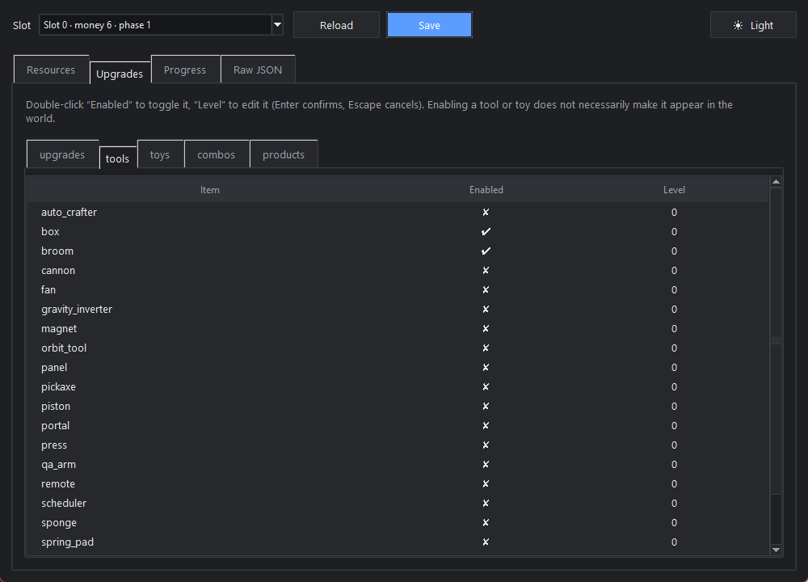

# Project P.I.T.T Save Editor

A small desktop editor for [**Project P.I.T.T.**](https://store.steampowered.com/app/4026250/) save
files (Steam, appid `4026250`). Edit money, upgrade levels, progress flags, or any value in the
save, with a backup before every write.



## The game

[**Project P.I.T.T.** on Steam](https://store.steampowered.com/app/4026250/), developed by **Froke**,
published by **Pretty Soon**, released 19 August 2026. This editor is a fan-made tool:
buy the game first, it is the whole reason this repository exists.

## Compatibility

| | |
|---|---|
| Game build | `1.0.5` (Godot 4.7.2), Windows |
| Save location | `%APPDATA%\Godot\app_userdata\Project P.I.T.T\` |
| Requirements | Python 3.10+, `pycryptodome` (tkinter ships with Python) |

Other builds will probably work: the editor reads whatever keys the save contains and never
assumes a fixed layout. Only the unlock list in `pitt_save/catalog.py` is build-specific.

## Run

```
pip install pycryptodome
python -m pitt_save
```

Or double-click `PITT Save Editor.pyw`.

## Use

1. **Close the game first.** The editor refuses to write while `projectpitt.exe` is running,
   because the game autosaves every 2 minutes and would overwrite your changes.
2. Pick a slot, edit, then hit **Save**.
3. Start the game. If Steam reports a cloud save conflict, keep the **local** version.

Tabs:

- **Resources**: money, bank, mining bank, money statistics.
- **Upgrades**: `upgrades`, `tools`, `toys`, `combos`, `products`: toggle *Enabled*, edit *Level*.
- **Progress**: phase, pickaxe tier, flags, and the 135 unlock milestones.
- **Raw JSON**: the whole save as a tree; every value is editable and keeps its type.

Light and dark themes, following your Windows setting by default; the button on the right toggles it.

## Safety

- Every write copies `savegame.save` and `profile.cfg` into `backups/<timestamp>/` first.
- The new save is written to a `.tmp` file, read back and decrypted to verify it, and only then
  moved into place. A failed check leaves the original untouched.
- `profile.cfg` (the slot summary shown in the game menu) is patched in place so the menu stays
  in sync. Only `money`, `phase` and `products` are replaced, the rest of the file stays byte-identical.
- The game's own `savegame.save.bak` is never touched, so it stays as a second fallback.

To roll back: close the game and copy both files from a `backups/` folder back into the save folder.

## How the save file works

`savegame.save` is a Godot `FileAccess.open_encrypted_with_pass` file: a `GDEC` header, the MD5 of
the plaintext, its length, a 16-byte IV, then AES-256-CFB ciphertext. The key is the 32 hex
characters of `md5(password)`, and the password is a constant in the game's own
`scripts/save_manager.gdc`. Inside, it is plain JSON.

See [docs/save-format.md](docs/save-format.md) for the byte layout, the save's JSON structure, and
how the constants were pulled out of the game's `.pck`.

## Tests

```
pip install pytest
python -m pytest
```

55 tests, including a byte-identical encrypt/decrypt round-trip against a real save file and a
safe-write check on a throwaway copy of the save folder.

Verified end to end on build 1.0.5: a save written by this editor loads in game, shows the edited
values, and the game's next autosave reads back cleanly.

## Notes

Single-player game, local files, your own saves. Editing a save can always break a run, which is
what the backups are for. Not affiliated with Froke or Pretty Soon; all trademarks belong to them.
